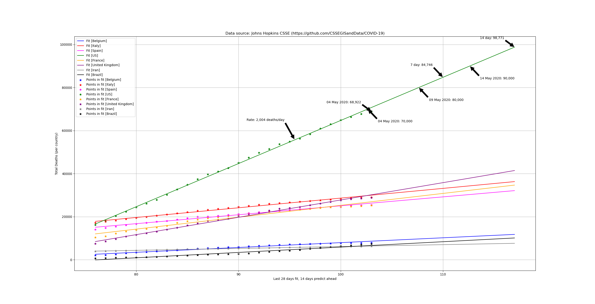

# What is this repository?

This repository contains simple python scripts to fit and plot
covid-19 data that is published daily by Johns Hopkins CSSE
(https://github.com/CSSEGISandData/COVID-19)

The scripts transparently fetch the remote data from the Johns Hopkins
github repository so they are super easy to run, modify, and
experiment with.

# But we have professional/expert models.

Yes, but sometimes <cough>IHME</cough> they swing wildly from update
to update, or are already significantly off by the time they are
upadted.  They have been shown to be terrible predictors or right on,
but there is no way to know.

https://towardsdatascience.com/transparency-reproducibility-and-validity-of-covid-19-projection-models-78592e029f28

# Fitting a straight line is stupid simple and easy and doesn't account for all the variables.

Yes.  But look at how linear the data is in places.  Tell me you know
what function will fit it better.  Will a hot spot flair up and drive
up the numbers for the next few days?  Will an existing hot spot begin
burning out and drive the trend downward? Look at how wildly the
expert IHME model has swung around (above analysis link.)  I don't
think the short term trend is knowable.  If we can't predict (in the
short term) if the plot is going to turn up or down, then a straight
line fit will be as stable and useful as anything.

# Why spend the time on this.

I think many of us are obsessed with the situation (early may as I
write this) and making and updating plots is an outlet.

# Daily plots

It might be useful to look back and see how well past plots predicted
today.  Or track the trend of the predictions over time (which could
be an indicator of the quality of the underlying model fit.)

## May 4, 2020

The past two days have been down (yeah!)  Let's hope the trend
continues and breaks the linear fit!  The 100k mark is looming out
there around May 20 at the current rate.

